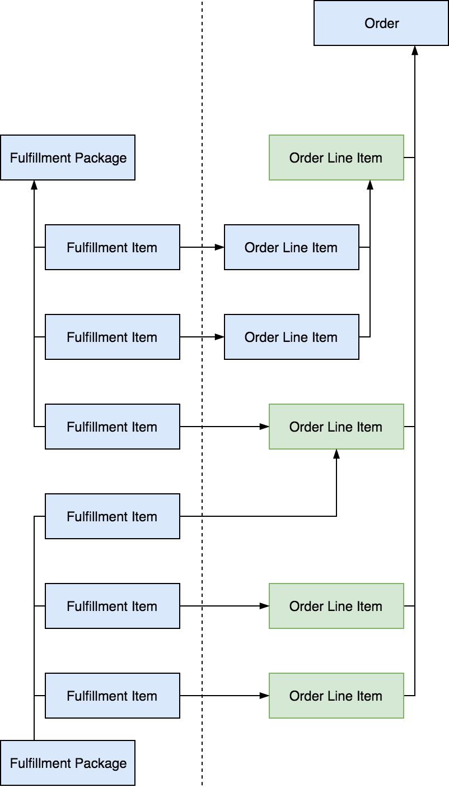
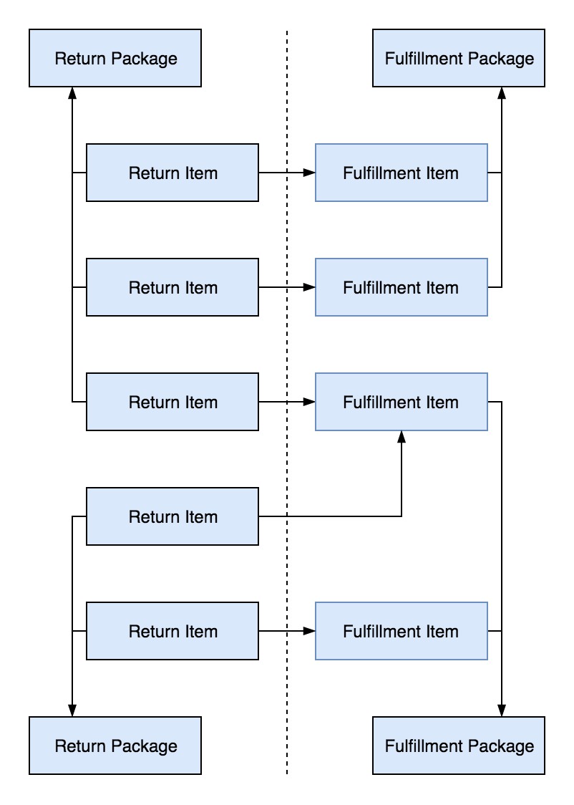

# Fulfillment & Return

Freshcom provides you with a few fulfillment related resources for you to implement your own fulfillment & return process. The fulfillment unit in Freshcom is very granular, each order line item can be fulfilled and returned multiple times if needed.

## Fulfillment

Each order in Freshcom require fulfillment, order is considered fulfilled when each of its top level order line item is fulfilled. A order line item with children is considered fulfilled if all of its children is fulfilled. A order line item without children is considered fulfilled when the sum of the quantity of all its fulfillment items is greater than or equal to the order quantity of the order line item. Below is a diagram illustrating an example fulfillment for a order. Green block in the diagram represent the top level order line items. Click to zoom in.

For each order line item there can be multiple fulfillment items, and each fulfillment item can belongs to different fulfillment packages. You can use multiple fulfillment package to fulfill a single order. When a order line item has children, then only its children should be fulfilled and once all children are fulfilled the parent is considered fulfilled as well. The fulfillment status of order line item and order is updated automatically one you have create a fulfillment item for them.

### Auto Fulfillment

You can set specific order line item to be auto fulfilled, this is useful for order line item that does not require any action on your side to fulfill it, for example a order line item for discounts, or unlockable product. When you enable auto fulfill for a order line item, a auto fulfillment package will be created as soon as the order become opened and a fulfillment item will be created immediately using that package for the order line item. The order line item will then be considered as fulfilled.

## Return

Fulfillment can be returned by creating a return package and a return item for the fulfillment item. An order line item is fully returned if the sum of its return item is equal or greater than the order quantity. A order is considered fully returned if all of its top level order line item is returned. Return requires a fulfillment item, which means if a order has not yet been fulfilled it cannot be returned. Below is a diagram illustrating an example a return for two fulfillment packages. Click to zoom in.

Each return package can contain multiple return item which may be for fulfillment item of different packages. You can also create multiple return packages, note that return package itself is independent to fulfillment package. Only the return item depends on fulfillment item.

## Next Steps



