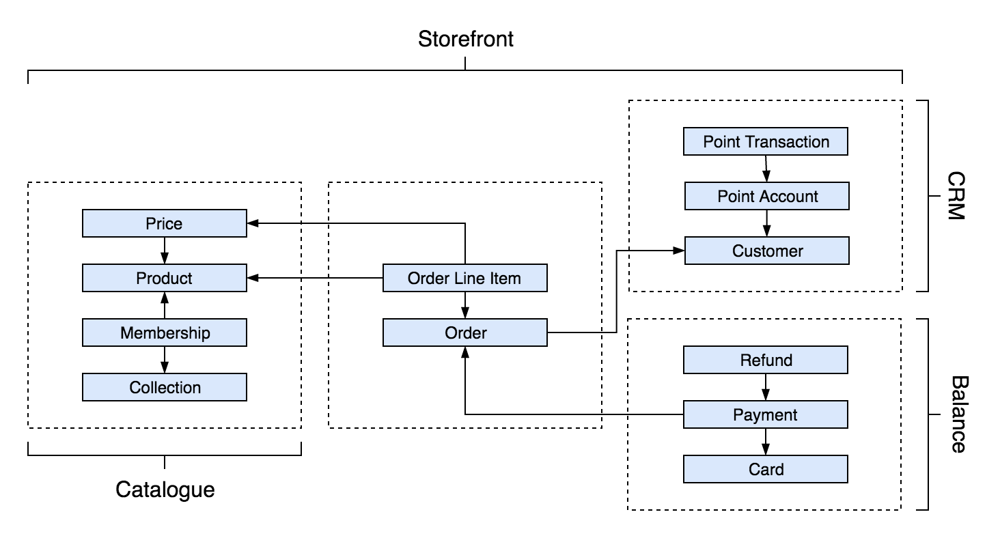

# Introduction

Freshcom provides many resources for you to use to model your business cases. We think it is important for you to have a high level understanding of the resources that Freshcom provided so you can better take advantage of the feature they provide.

The diagrams below illustrate the relationships and grouping of resources.

