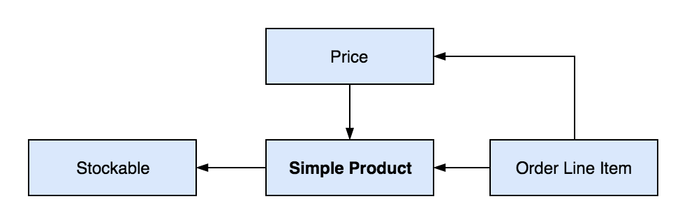
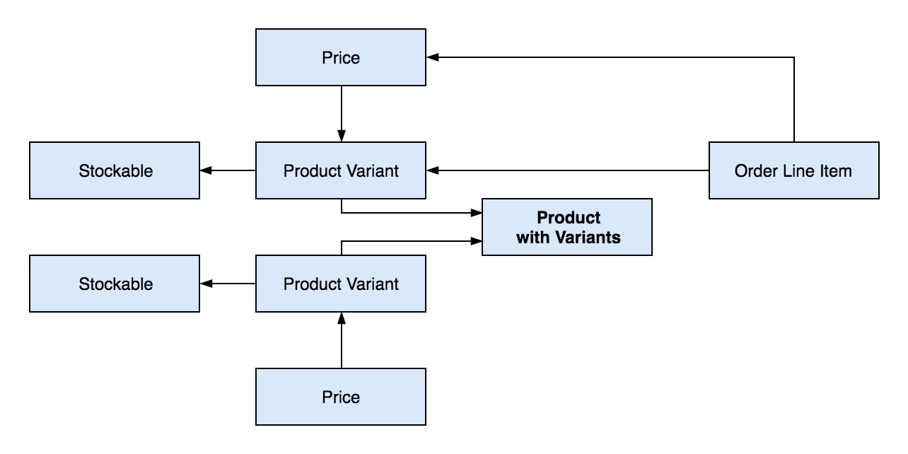
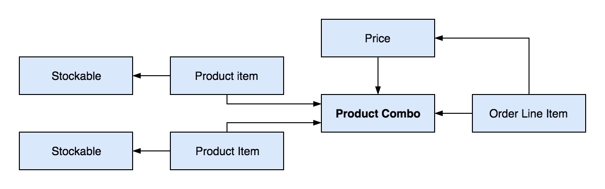

# Product

Product in Freshcom represents goods for sell. Its essentially goods with a price. In order to create a product you must create a goods first. Please see our guide on [goods](../goods.md) for how to create one. Freshcom give you various way to sell your goods through different kind of products. There are 3 main kinds of product.

* Simple Product
* Product with Variants
* Product Combo

## Simple Product

As the name suggest a simple product is a product in its simplest form. Simple product connects directly to a goods and must have at least one price in order to be activated.

A diagram below shows the resource instances that make up a simple product and how order line item connects to them. Note that we using stockable as an example goods, you can substitute stockable with any valid type of goods.

## Product with Variants

Product with variants is a product that consist of different variants and customer usually pick from one of the variants to put into their cart. An example of product with variants is a t-shirt. A t-shirt even though is a single product actually comes in different size, so its size will be a variant of the same product.

Product with variants do not directly connect to a goods, instead it has variants and each variant connects to a goods. The price will also be for each variant and not for the product itself.

A diagram below shows the resource instances that make up a product with variants and how order line item connects to them. Note that we using stockable as an example goods, you can substitute stockable with any valid type of goods.

Product with variants and the variant itself are actually the same resource, they are both represented by the product resource just with different kind: `withVariants` and `variant`. Variant can be associated with its parent product using the `parent` relationship and its parent must be of kind `withVariants`. Please see our API references for detail.

## Product Combo

Product combo is a product that consist of two or more item and the customer are only allowed to buy all of the item together but not separately. Product combo do not directly connect to a goods, instead it has item and each item connects to a goods. The price for the product combo is directly connect to it and it means the price for all the item combined, item itself does not have price. 

A diagram below shows the resource instances that make up a product combo and how order line item connects to them. Note that we using stockable as an example goods, you can substitute stockable with any valid type of goods.

Product combo and the each item itself are actually the same resource, they are both represented by the product resource just with different kind: `combo` and `item`. Item can be associated with its parent product using the `parent` relationship and its parent must be of kind `combo`. Please see our API references for detail.

## Activate a Product

You can created and activate a product through the Dashboard. Only user with specific role can see non-active product. When you first create a product it will always be in `draft` status because at the time you create a product it does not have a active price. You must then create a active price for the product, only then can you mark the product as active. Create and activate a product is a 4 step process:

1. Create a goods.
2. Create a product for the goods.
3. Create a price for the product or its variant.
4. Mark the product as active.

## Next Steps





